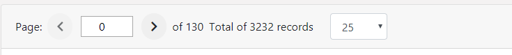

This project was bootstrapped with [Create React App](https://github.com/facebook/create-react-app).

## Getting started
1.	Make sure you have [`git`](https://git-scm.com/), [`node`](https://nodejs.org/), and [`npm`](https://www.npmjs.com/get-npm) installed.
2.	Clone this repository locally.
4.  Change the current working directory to the cloned repository.
3.	Run `npm install` to install dependencies.
4.	Execute `npm start` from the root directory of the repository to start web server.
5.	Open [`http://localhost:3000`](http://calypso.localhost:3000/) in your browser.

## Available Scripts

In the project directory, you can run:

### `npm start`

Runs the app in the development mode. 
Open [http://localhost:3000](http://localhost:3000) to view it in the browser.

The page will reload if you make edits. 
You will also see any lint errors in the console.

### `npm test`

Launches the test runner in the interactive watch mode. 
See the section about [running tests](https://facebook.github.io/create-react-app/docs/running-tests) for more information.

### `npm run build`

Builds the app for production to the `build` folder. 
It correctly bundles React in production mode and optimizes the build for the best performance.

The build is minified and the filenames include the hashes. 
Your app is ready to be deployed!

See the section about [deployment](https://facebook.github.io/create-react-app/docs/deployment) for more information.

### `npm run eject`

**Note: this is a one-way operation. Once you `eject`, you can’t go back!**

If you aren't satisfied with the build tool and configuration choices, you can `eject` at any time. This command will remove the single build dependency from your project.

Instead, it will copy all the configuration files and the transitive dependencies (Webpack, Babel, ESLint, etc) right into your project so you have full control over them. All of the commands except `eject` will still work, but they will point to the copied scripts so you can tweak them. At this point you’re on your own.

You don’t have to ever use `eject`. The curated feature set is suitable for small and middle deployments, and you shouldn’t feel obligated to use this feature. However we understand that this tool wouldn't be useful if you could not customize it when you are ready for it.

## Project Description

### Project Structure
The project is structured, to a large extent, as recommended by [redux team](https://redux.js.org/faq/code-structure). Specifically, `Rails-style`: separate folders for “actions”, “constants”, “reducers”, “containers”, and “components”.

### Login Page
This is the output of Login.jsx component
 

#### Login Page Errors
Handling of REST API error responses from the backend server.

#### Login Page Input

Upon supplying correct credentials, user is successfully logged in and redirect to the tasks list page.

#### Tasks List Page

Tasks list page as  the output of Task.jsx. The data is retrieved from REST API back end using [axios](https://github.com/axios/axios)

#### Tasks Pagination

The pagination bar assist in scrolling through the data received from the back end. 

I opted for input field `type: number` as opposed to select field because it is more suited for handling huge number of rows especially for small to medium screen devices.

Also added logic for handling minimum (0) and maximum (open) number of pages where the buttons are disabled appropriately and the input number spinners are constrained accordingly. 

The select dropdown enable setting the limit (number of records per page), the default is `25` records. 

The pagination from the back end starts from `0` (zero), that may needed improvement from that side.

#### Logout Link

Logout link.  Also, users not logged in are redirected to login page.

#### Not found page

Users visiting a link that does not exist are directed  to this page.

